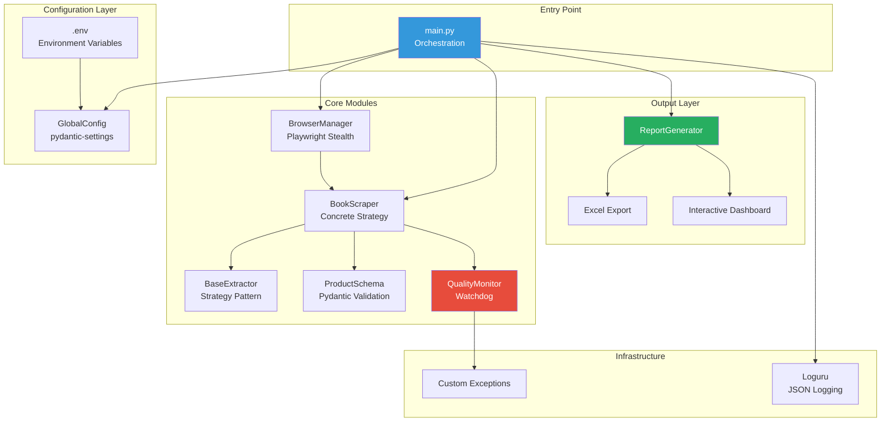

# MarketPulse-Pro

**Enterprise-Grade Web Scraping Pipeline with Resilience, Observability, and Intelligence**

[](https://www.python.org/downloads/)
[](https://github.com/astral-sh/ruff)
[](https://mypy-lang.org/)

## Overview

MarketPulse-Pro is a production-ready web scraping framework designed to demonstrate enterprise software engineering capabilities. It extracts, validates, and visualizes product data with built-in resilience mechanisms and quality monitoring.

### Key Features

- **Stealth Mode**: User-agent rotation, webdriver masking, and human-like interaction patterns
- **Watchdog Monitoring**: Automatic detection of layout shifts with configurable failure thresholds
- **Interactive Reporting**: Excel exports and Plotly-powered HTML dashboards
- **12-Factor Compliance**: Environment-based configuration with strict validation
- **Structured Logging**: JSON-formatted logs for enterprise log aggregation systems

---

## Architecture Overview



---

## Project Structure

```
marketpulse-pro/
├── config/
│   ├── __init__.py          # Configuration exports
│   └── settings.py          # GlobalConfig (pydantic-settings)
├── src/
│   ├── __init__.py          # Package metadata
│   ├── browser.py           # BrowserManager (Playwright + Stealth)
│   ├── exceptions.py        # Custom exception hierarchy
│   ├── extractor.py         # BaseExtractor (Strategy Pattern)
│   ├── logger.py            # Loguru configuration
│   ├── reporter.py          # Excel + Plotly reporting
│   ├── scraper.py           # BookScraper implementation
│   └── validator.py         # Pydantic schemas + Watchdog
├── tests/                    # Pytest test suite
├── logs/                     # Structured JSON logs (auto-generated)
├── output/                   # Reports (auto-generated)
├── .gitignore
├── .env.example           # Environment template
├── main.py                   # Entry point
├── Makefile                  # Standardized commands
├── pyproject.toml            # Project metadata
└── README.md
```

---

## Quick Start

### Prerequisites

- Python 3.12 or higher
- pip (Python package manager)

### Installation

```bash
# Clone the repository
git clone <repository-url>
cd marketpulse-pro

# Install with development dependencies
make setup

# Or manually:
pip install -e ".[dev]"
python -m playwright install chromium
```

### Configuration

```bash
# Copy the environment template
copy .env.example .env    # Windows
cp .env.example .env      # Linux/Mac

# Edit .env with your settings
```

### Execution

```bash
# Run the scraping pipeline
make run

# Or directly:
python main.py
```

---

## Engineering Decisions

### 1. Strategy Pattern for Extractors

**Problem**: Supporting multiple target websites without modifying core logic.

**Solution**: Abstract `BaseExtractor[T]` class with generic type parameter for schema binding. New sites require only a new concrete class implementation.

**Benefits**:
- Open/Closed Principle compliance
- Type-safe schema relationships
- Isolated testing per strategy

### 2. Watchdog Quality Monitoring

**Problem**: Silent data corruption from layout shifts or selector drift.

**Solution**: `QualityMonitor` tracks extraction success/failure ratios per batch. If failures exceed 30% threshold, `LayoutShiftError` halts execution.

**Benefits**:
- Prevents database pollution
- Early warning for maintenance needs
- Configurable thresholds per environment

### 3. Exponential Backoff with Jitter

**Problem**: Rate limiting and network flakiness causing cascade failures.

**Solution**: `tenacity` library integration with randomized jitter to prevent thundering herd.

**Configuration**:
```python
RETRY_MAX_ATTEMPTS=3
RETRY_BASE_DELAY_SEC=1.0
RETRY_MAX_DELAY_SEC=60.0
```

### 4. Browser State Persistence

**Problem**: Repeated authentication flows wasting time and triggering bot detection.

**Solution**: `BrowserManager.save_state()` persists cookies and localStorage to `storage_state.json`. Subsequent runs inject state to resume sessions.

### 5. Structured JSON Logging

**Problem**: Log aggregation systems (ELK, Splunk) require parseable formats.

**Solution**: Custom Loguru serializer outputs single-line JSON with:
- ISO 8601 timestamps (UTC)
- Log level, module, function, line number
- Exception details with traceback flag
- Arbitrary context fields

**Example Output**:
```json
{"timestamp": "2026-01-20T10:30:00.000Z", "level": "INFO", "message": "Pipeline started", "context": {"app_name": "MarketPulse-Pro"}}
```

---

## Configuration Reference

| Variable | Default | Description |
|----------|---------|-------------|
| `BASE_URL` | `https://books.toscrape.com/` | Target website URL |
| `MAX_CONCURRENT_REQUESTS` | `5` | Async semaphore limit |
| `REQUEST_TIMEOUT_MS` | `30000` | Network request timeout |
| `WATCHDOG_FAILURE_THRESHOLD` | `0.30` | Max failure ratio (30%) |
| `PAGINATION_LIMIT` | `0` | Max pages (0 = unlimited) |
| `LOG_LEVEL` | `INFO` | Minimum log level |

See `.env.example` for complete configuration options.

---

## Output Examples

### Excel Report

Generated at `output/marketpulse_export_YYYYMMDD_HHMMSS.xlsx`:

| Sheet | Contents |
|-------|----------|
| Raw Data | All extracted items with title, price, stock, rating, URL |
| Summary | Extraction metadata and aggregate statistics |
| Price Analysis | Min, max, mean, median, std deviation |
| Rating Distribution | Count per rating level |

### Interactive Dashboard

Generated at `output/marketpulse_dashboard_YYYYMMDD_HHMMSS.html`:

- **Price Distribution Histogram**: Visualize pricing clusters
- **Stock Availability Pie Chart**: In Stock vs Out of Stock ratio
- **Top 10 Highest Rated**: Horizontal bar chart of premium items
- **Rating Distribution**: Count breakdown by star rating

---

## Troubleshooting

### Common Issues

#### 1. `LayoutShiftError: Failure ratio exceeds threshold`

**Cause**: Target site structure has changed, breaking CSS selectors.

**Solution**:
1. Inspect the target page manually
2. Update selectors in `.env`:
   ```
   CSS_SELECTOR_TITLE=<new-selector>
   CSS_SELECTOR_PRICE=<new-selector>
   ```
3. Re-run the pipeline

#### 2. `BrowserInitializationError: Browser not installed`

**Cause**: Playwright browsers not downloaded.

**Solution**:
```bash
python -m playwright install chromium
```

#### 3. `NavigationError: HTTP 429`

**Cause**: Rate limiting by target server.

**Solution**:
1. Reduce concurrency: `MAX_CONCURRENT_REQUESTS=2`
2. Increase delays: `RETRY_BASE_DELAY_SEC=3.0`
3. Add pagination limit for testing: `PAGINATION_LIMIT=5`

#### 4. Empty extraction results

**Cause**: Page content loaded asynchronously, selector timeout.

**Solution**:
1. Increase timeout: `REQUEST_TIMEOUT_MS=60000`
2. Check if target requires JavaScript rendering
3. Verify selectors match current DOM structure

---

## Development

### Running Tests

```bash
# Run all tests
make test

# Run with coverage
make test-cov
```

### Code Quality

```bash
# Lint check
make lint

# Auto-format
make format

# Type check
make typecheck
```

---

## License

MIT License - See LICENSE file for details.

---

## Author

**Takeaki Nadabe**
*Senior Software Architect*

Built as a portfolio demonstration of enterprise-grade software engineering, implementing SOLID principles and self-healing architecture.